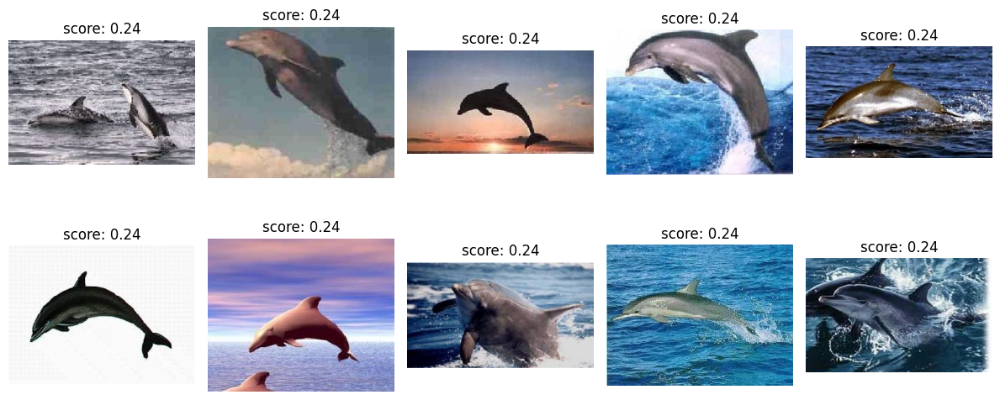

### A Simple Vector Search Engine

This is a vector serach engine which computes embeddings using LLMs (CLIP-Vit) and generates a local database using hnsw library.

The functionality includes:
1. Indexing images to the database
2. Retriving/searching images using either prompt or image.

### Usage
This example assumes you have images in ```../data/*.jpg ```
```
from vec_search import DataBaseVectorSearch

# instantiate vector search
vs = DataBaseVectorSearch() 

# Add data for indexing
dir_path = '../data/*.jpg'
vs.add_images_from_dir(dir_path)

# query with prompt input
output = vs.query_database_prompt("dolphins jumping out of water", 10, show_images=True)

# query with image input
output = vs.query_database_prompt(image_path, 10)

```
Output for the prompt "dolphins jumping out of water"


### Database
A database will be created at the location specified in the ```./configs/config.yaml ``` 

Update the fields in the yaml file to create new database.

Once the datbase is created subsequent instantiation of vector serach will append to the database specified in the ```./configs/config.yaml```